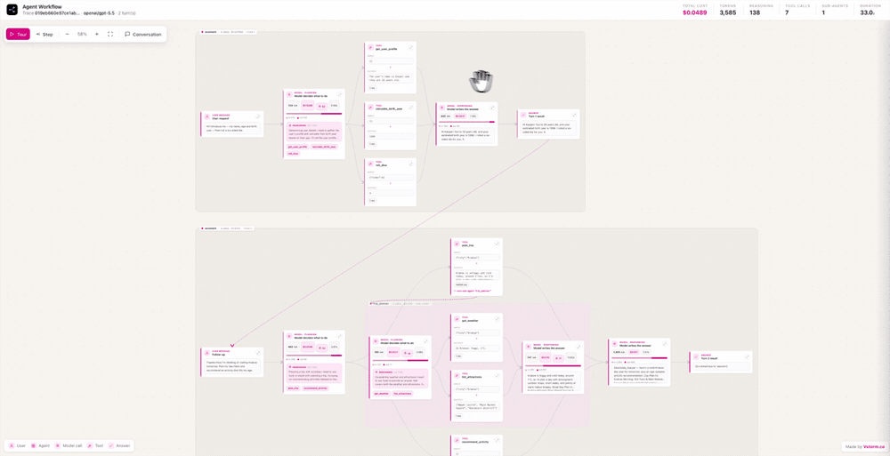
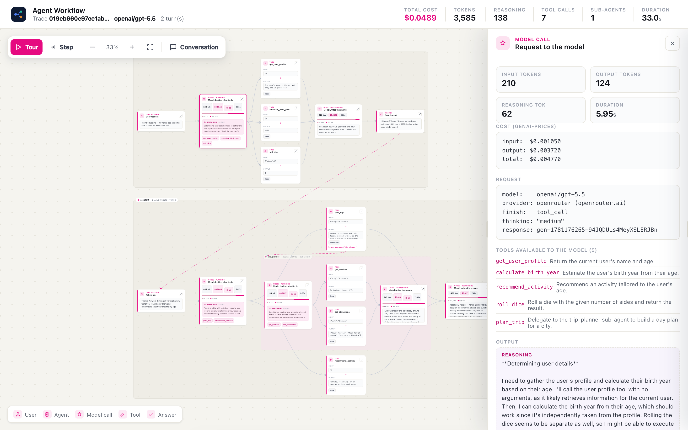
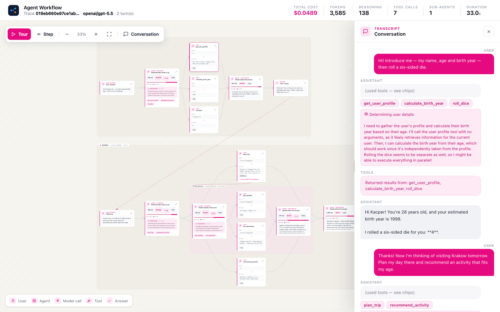
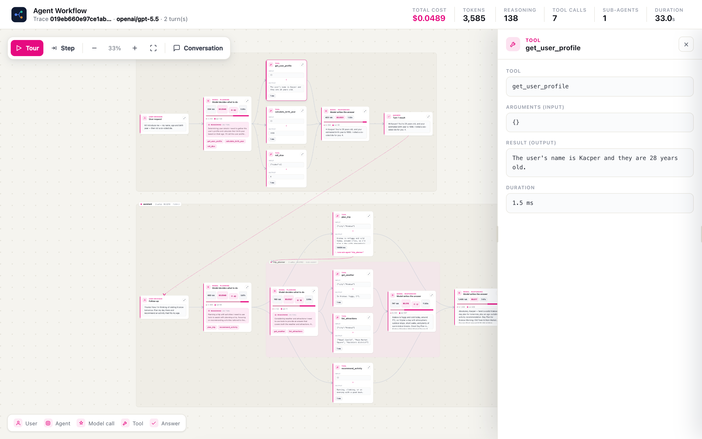
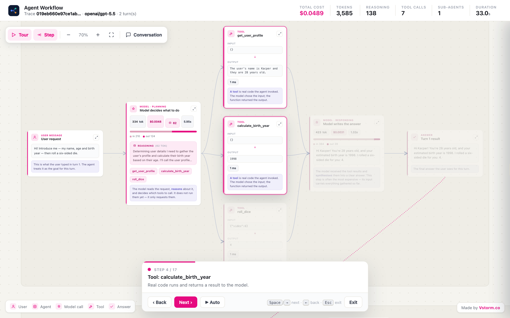

<p align="center">
  
</p>

<h1 align="center">agentcanvas</h1>

<p align="center">
  <b>See exactly how your AI agent works.</b><br>
  Turn Pydantic AI runs logged to Logfire into a polished, animated diagram of the whole workflow —
  every model call, tool, nested sub-agent, token and dollar.
</p>

<p align="center">
  <a href="#-what-it-shows">Features</a> &middot;
  <a href="#-quick-start">Quick start</a> &middot;
  <a href="#-how-it-works">How it works</a> &middot;
  <a href="#-architecture">Architecture</a> &middot;
  <a href="CONTRIBUTING.md">Contributing</a>
</p>

<p align="center">
  
</p>

<table>
<tr>
<td width="50%"><br><sub>Click any node for a full inspector — tokens, exact cost, reasoning, the tools the model could call.</sub></td>
<td width="50%"><br><sub>The full multi-turn conversation, with tool calls and reasoning.</sub></td>
</tr>
<tr>
<td width="50%"><br><sub>Per-tool input, output and timing.</sub></td>
<td width="50%"><br><sub>A guided tour (auto or manual) narrates each step for client demos.</sub></td>
</tr>
</table>

<p align="center">
  <a href="https://www.python.org/downloads/"></a>
  <a href="https://github.com/pydantic/pydantic-ai"></a>
  <a href="https://pydantic.dev/logfire"></a>
  <a href="https://opensource.org/licenses/MIT"></a>
  <a href="https://vstorm.co"></a>
</p>

---

## Why

Clients rarely understand what an "AI agent" actually does. They see a prompt and an answer —
not the reasoning, the tool calls, the sub-agents, or the cost. **agentcanvas** reads the
trace your agent already sends to Logfire and renders it as a clear, interactive block diagram you
can put on screen in a meeting: *this is the question, here is what the model decided, these are the
tools it ran, this is what each step cost, and here is the answer.*

---

## ✨ What it shows

<table>
<tr>
<td><b>🧩 Block diagram</b></td>
<td>The full run as a flow: <code>User → Agent → model call → tools → model call → answer</code>, on a pan / zoom / drag canvas.</td>
</tr>
<tr>
<td><b>🪆 Nested agents</b></td>
<td>When a tool is itself another agent (with its own tools), it is drawn as a nested frame — recursively, to any depth. The diagram grows with the system.</td>
</tr>
<tr>
<td><b>💬 Full conversation</b></td>
<td>Every turn is its own frame, connected in sequence. A side panel shows the complete <code>user → assistant → user → assistant</code> transcript.</td>
</tr>
<tr>
<td><b>🧠 Reasoning</b></td>
<td>The model's "thinking" summary and reasoning-token counts, shown on each model call and in the transcript.</td>
</tr>
<tr>
<td><b>💰 Exact cost</b></td>
<td>Per model call and for the whole run, computed from tokens via <a href="https://github.com/pydantic/genai-prices">genai-prices</a>.</td>
</tr>
<tr>
<td><b>🔢 Token usage</b></td>
<td>Input / output / reasoning tokens, per step and aggregated.</td>
</tr>
<tr>
<td><b>🔎 Deep detail</b></td>
<td>Provider, finish reason, response id, the tools available to the model (with descriptions), output mode and thinking config — in a click-through, resizable inspector.</td>
</tr>
<tr>
<td><b>🎬 Guided tour</b></td>
<td>An <b>auto</b> walkthrough and a <b>manual</b> step mode (Space / click / arrows, with back), each with plain-language narration for client demos.</td>
</tr>
<tr>
<td><b>📦 Self-contained</b></td>
<td>The output is a single HTML file — no server, no build, works offline, easy to send.</td>
</tr>
</table>

---

## 🚀 Quick start

```bash
pip install agentcanvas
```

Set `LOGFIRE_READ_TOKEN` in your environment (or a `.env` file), then build the
report from your latest agent run:

```bash
agentcanvas                       # latest run → agent_flow.html (opens in browser)
agentcanvas --list                # list recent runs
agentcanvas --trace-id <id>       # a specific run
agentcanvas -o report.html --no-open
```

Or use it as a library:

```python
from agentcanvas import LogfireClient, parse_run, render_html

client = LogfireClient()                       # reads LOGFIRE_READ_TOKEN
trace_id = client.latest_trace_id()
report = parse_run(client.fetch_trace(trace_id), trace_id)
open("report.html", "w").write(render_html(report))
```

| Variable | Used for |
|----------|----------|
| `LOGFIRE_READ_TOKEN` | reading traces via the Logfire Query API (required) |
| `LOGFIRE_BASE_URL` | optional region override (default US; EU: `https://logfire-eu.pydantic.dev`) |
| `LOGFIRE_WRITE_TOKEN` | the example agent sending telemetry to Logfire |
| `OPENROUTER_API_KEY` | the example agent (model via OpenRouter) |

### Try the example agent

The repo ships a runnable example (`assets/scripts/main.py`) — a thinking agent with five tools,
a nested sub-agent and a multi-turn conversation. From a checkout:

```bash
uv sync --all-extras --prerelease=allow              # installs the `demo` extra
uv run --prerelease=allow python assets/scripts/main.py   # generates a sample trace in Logfire
agentcanvas                                       # visualize it
```

---

## 🔍 How it works

```
Logfire (OpenTelemetry GenAI spans)  ──query──►  parser  ──►  payload  ──render──►  agent_flow.html
```

Pydantic AI's instrumentation emits OpenTelemetry GenAI spans (`invoke_agent`, `chat`,
`execute_tool`). agentcanvas reads them through the Logfire **Query API** (SQL + a read token),
rebuilds the span tree into a recursive workflow (turns → rounds → tools → nested agents), prices it
with `genai-prices`, and renders a single self-contained HTML report.

---

## 🏗️ Architecture

| Module | Role |
|--------|------|
| `logfire_client.py` | Logfire Query API client (SQL → rows) |
| `parser.py` | span tree → recursive payload (turns, rounds, tools, nested agents) |
| `pricing.py` | exact cost from tokens via `genai-prices` |
| `render.py` | payload → embedded HTML / CSS / JS report |
| `viz.py` | CLI entry point |
| `assets/scripts/main.py` | demo agent: thinking, five tools, a nested sub-agent, a multi-turn conversation |
| `assets/scripts/make_demo.py` · `make_screenshots.py` | record the demo video / capture doc screenshots |

---

## Development

```bash
git clone https://github.com/vstorm-co/agentcanvas.git
cd agentcanvas
make install      # uv sync (incl. dev tools)
make all          # ruff + mypy + pytest
```

The library is fully typed and tested; `make all` must pass before a PR.
See [CONTRIBUTING.md](CONTRIBUTING.md) for details.

---

## Changelog

See [CHANGELOG.md](CHANGELOG.md).

## License

MIT — see [LICENSE](LICENSE).

---

<div align="center">

### Need help shipping AI agents in production?

<p>We're <a href="https://vstorm.co"><b>Vstorm</b></a> — an Applied Agentic AI Engineering Consultancy<br>
with 30+ production agent implementations.</p>

<a href="https://vstorm.co/contact-us/">
  
</a>

<br><br>

Made with **care** by <a href="https://vstorm.co"><b>Vstorm.co</b></a>

</div>
